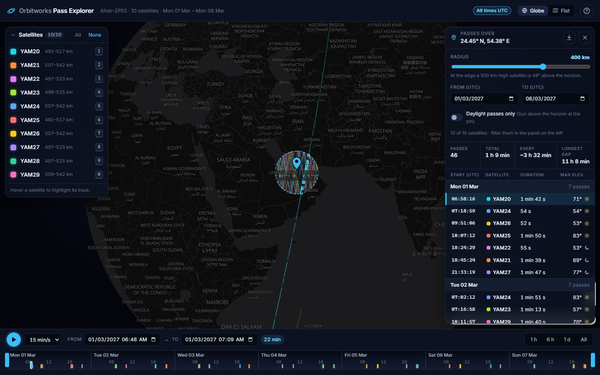
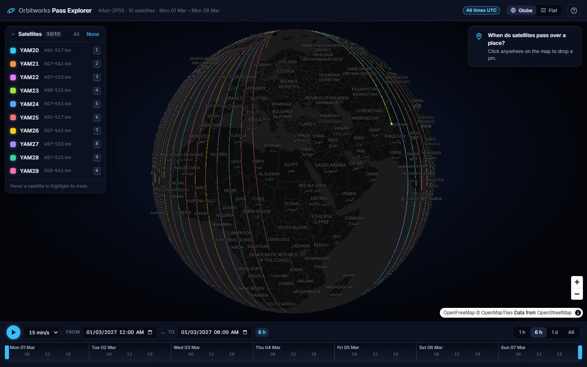
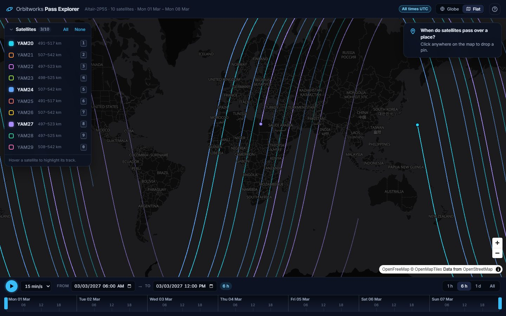
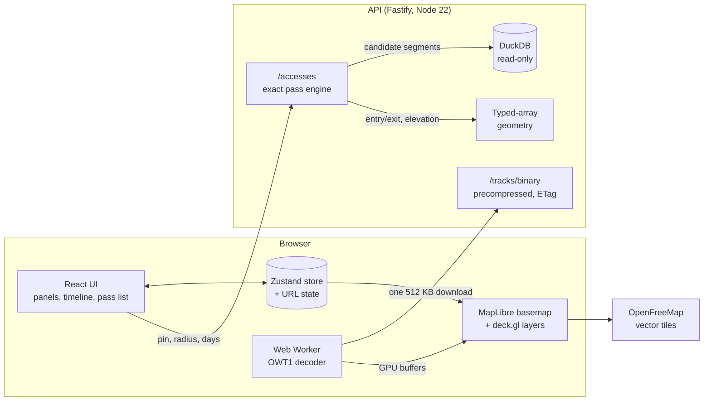

# Orbitworks Pass Explorer

A map-centric explorer for a week of simulated satellite passes (10 satellites, 100,810 one-minute
track segments). Filter the tracks by satellite and time and the map redraws instantly. Drop a pin
anywhere on Earth and it lists every pass over that place, drawn on the map and on the timeline.

**Live:** [orbitworks-pass-explorer.vercel.app](https://orbitworks-pass-explorer.vercel.app) (web,
Vercel) · [API docs](https://api-production-b649a.up.railway.app/api/docs/) (Railway)



| All ten satellites, 6 hours, on the globe             | Three satellites, flat map                                   |
| ----------------------------------------------------- | ------------------------------------------------------------ |
|  |  |

## Core requirements

The Orbitworks team asked, by email, for the core requirements of the brief
([docs/CHALLENGE.md](docs/CHALLENGE.md)) to be clearly satisfied, with clean implementation, solid
testing and thoughtful documentation. Anything beyond them is a bonus. Each requirement below links
to where it is implemented, how it is tested, and where the decision is documented.

**The two functions**

| Requirement (brief)                                                            | Implementation                                                                                                                                                                 | Tests                                                                                                                                                                                            | Decision         |
| ------------------------------------------------------------------------------ | ------------------------------------------------------------------------------------------------------------------------------------------------------------------------------ | ------------------------------------------------------------------------------------------------------------------------------------------------------------------------------------------------ | ---------------- |
| Display the passes on a map                                                    | All ten satellites' tracks drawn with deck.gl over MapLibre ([`layers.ts`](apps/web/src/map/layers.ts), [`TrackLayer.ts`](apps/web/src/map/TrackLayer.ts))                     | [`tracks.spec.ts`](apps/web/e2e/tracks.spec.ts): all ten satellite layers drawn; track pixels checked on screen, with a negative control                                                         | ADR-002, ADR-008 |
| Select a subset of satellites                                                  | Satellite panel: toggle, solo, all/none, keys `1`…`0` ([`SatellitePanel.tsx`](apps/web/src/features/satellites/SatellitePanel.tsx))                                            | Store tests; [`tracks.spec.ts`](apps/web/e2e/tracks.spec.ts): hide, solo, restore, keyboard                                                                                                      | ADR-008          |
| Time-range (min–max) filter                                                    | Timeline window with draggable handles, presets and exact UTC inputs ([`Timeline.tsx`](apps/web/src/features/timeline/Timeline.tsx))                                           | [`timelineMath.test.ts`](apps/web/src/features/timeline/timelineMath.test.ts); [`timeline.spec.ts`](apps/web/e2e/timeline.spec.ts): presets, drag, handles, typed times                          | ADR-008          |
| The map refreshes quasi instantly on filter changes                            | One 512 KB download, then filters change GPU uniforms and visibility only: no request, no re-upload                                                                            | E2E asserts **zero API requests** while scrubbing, playing and toggling, with and without a pin; size and Lighthouse budgets in CI                                                               | ADR-002, ADR-010 |
| Select a point on the map                                                      | Click to drop a pin, drag to move it ([`mapController.ts`](apps/web/src/map/mapController.ts), [`accessOverlay.ts`](apps/web/src/map/accessOverlay.ts))                        | [`accesses.spec.ts`](apps/web/e2e/accesses.spec.ts): click, drag, pins at the antimeridian and a pole                                                                                            | ADR-009          |
| Geographic intersection with a user-selectable radius, start date and end date | `GET /api/v1/accesses`: DuckDB candidate scan, then exact arc–circle intersection ([`passes.ts`](apps/api/src/domain/passes.ts)); radius slider and UTC day range in the panel | Property tests against brute-force sampling ([`passes.test.ts`](apps/api/src/domain/passes.test.ts)); API integration tests ([`api.test.ts`](apps/api/test/api.test.ts)); E2E filters and reload | ADR-003          |
| Quick accesses list for the next days (brief, function 2)                      | The pass table, grouped by UTC day, with duration, maximum elevation, day/night and stats; CSV export ([`AccessPanel.tsx`](apps/web/src/features/accesses/AccessPanel.tsx))    | [`accesses.spec.ts`](apps/web/e2e/accesses.spec.ts): the brief's UAE example (06:58 YAM20, 10:07 YAM25), listed by day; CSV contents                                                             | ADR-009          |
| Show the selected portions of the tracks that match                            | Pass portions highlighted on the map, listed by day in the table, marked on the timeline ([`accessMath.ts`](apps/web/src/features/accesses/accessMath.ts))                     | [`accessMath.test.ts`](apps/web/src/features/accesses/accessMath.test.ts); E2E hover and click on a map portion                                                                                  | ADR-004, ADR-009 |
| Readability and synchronization of the map and the table                       | Hover in any of table, map or timeline highlights the other two; a click frames the pass                                                                                       | [`accesses.spec.ts`](apps/web/e2e/accesses.spec.ts): three-way sync                                                                                                                              | ADR-009          |

**Technical constraints**

| Requirement (brief)                                               | How it is met                                                                                                                                                                                                                                           |
| ----------------------------------------------------------------- | ------------------------------------------------------------------------------------------------------------------------------------------------------------------------------------------------------------------------------------------------------- |
| Deployment-ready                                                  | Deployed: web on Vercel, API on Railway. Images published to GHCR with SBOM and provenance. A browser smoke test runs against the live site after every Vercel production deploy (ADR-006, ADR-011).                                                    |
| Formatting, readability, elegance                                 | TypeScript strict, no `any`, one shared API contract; conventions in [`CLAUDE.md`](CLAUDE.md), checked on every edit and commit.                                                                                                                        |
| ESLint, Stylelint, Prettier                                       | [`eslint.config.js`](eslint.config.js) (typescript-eslint strict, sonarjs, security, react-hooks), [`.stylelintrc.json`](.stylelintrc.json), [`.prettierrc.json`](.prettierrc.json). Enforced by the git hooks and CI.                                  |
| Unit testing                                                      | 644 unit and integration tests across the three packages, with coverage gates (shared ≥ 95 %, API ≥ 90 %, web logic ≥ 85 %). Plus 35 Playwright E2E tests against the production build, and a browser smoke test of the Docker stack and the live site. |
| Quality of the documentation                                      | This README, 11 ADRs with the measurements behind each decision ([docs/DECISIONS.md](docs/DECISIONS.md)), OpenAPI at `/api/docs`, and "why" comments in the code.                                                                                       |
| State-of-the-art CI/CD                                            | GitHub Actions with SHA-pinned actions. Runs quality, tests, E2E, performance budgets, Docker build with smoke tests and Trivy, CodeQL, dependency review and gitleaks. Release gated on CI; continuous deployment from `main`.                         |
| Dockerfile and docker-compose.yml                                 | [`apps/api/Dockerfile`](apps/api/Dockerfile), [`apps/web/Dockerfile`](apps/web/Dockerfile), [`docker-compose.yml`](docker-compose.yml): hardened, non-root, read-only, smoke-tested in CI.                                                              |
| TypeScript rather than JavaScript                                 | Everything, strict mode (ADR-001).                                                                                                                                                                                                                      |
| Coding agent instructions and strategy documented                 | [docs/AI_USAGE.md](docs/AI_USAGE.md), plus the harness itself in [`CLAUDE.md`](CLAUDE.md) and [`.claude/`](.claude).                                                                                                                                    |
| Backend: the provided GeoJSON                                     | Seeded from [`data/`](data), unmodified, by DuckDB's native `read_json` ([`build.ts`](apps/api/src/db/build.ts), run by `pnpm seed`).                                                                                                                   |
| Backend: Node.js or Python                                        | Node 22, Fastify 5.                                                                                                                                                                                                                                     |
| Backend: DuckDB (spatial extension suggested)                     | DuckDB stores the segments and runs the candidate search. The spatial R-tree was measured and **not** used: it was slower and unpredictable for large circles (up to 28 ms against about 3 ms for a numeric scan). The justification is in ADR-003.     |
| Backend: GraphQL or REST                                          | REST with OpenAPI (Swagger UI at `/api/docs`), validated by the shared zod schemas.                                                                                                                                                                     |
| Frontend: open-source mapping engine                              | MapLibre GL JS, with deck.gl for the tracks.                                                                                                                                                                                                            |
| Frontend: public open-data basemap, vector tiles, no self-hosting | OpenFreeMap vector tiles (OpenStreetMap data), loaded from the public service. A blank fallback style keeps the tracks usable if it is unreachable.                                                                                                     |
| Frontend: React or Vue                                            | React 19.                                                                                                                                                                                                                                               |
| Frontend: readability over accessibility                          | Dark, high-contrast theme, a "All times UTC" label, a per-satellite colour legend, readable numbers with units.                                                                                                                                         |
| DuckDB-WASM (optional)                                            | Considered, not used: the pass geometry runs on the server so it is computed and tested in one place (ADR-003, ADR-004).                                                                                                                                |

Everything in [What it does](#what-it-does) beyond the table above (playback, globe view, tooltip,
daylight filter, statistics, CSV export, shareable links, onboarding, resilience) is a bonus.

## What it does

**1. Tracks on a map, filtered instantly.**

- **Download once.** The whole week (59 MB as GeoJSON) arrives as one 512 KB binary stream and is
  decoded in a Web Worker.
- **Filter on the GPU.** Time and satellite filters change GPU parameters only: no network
  request and no re-upload, so playback just moves a window on the GPU.
- **Timeline.** A draggable window with 1 h / 6 h / 1 d / All presets, exact UTC inputs, play at
  adjustable speed, and arrow-key nudges.
- **Satellite panel.** Toggle satellites, solo one (`Shift`+`1…0`), or hover a row to highlight
  its track.
- **Globe or flat map.** OpenFreeMap vector tiles (OpenStreetMap data).
- **Track tooltip.** Hover a track to see the satellite, UTC time, altitude and local solar time.

**2. Passes over a place.**

- **Pin.** Click the map to drop a pin, drag to move it. The API returns every pass inside the
  circle, with exact entry and exit times computed on the sphere.
- **Radius and dates.** The radius slider (10–2,500 km) shows the elevation of a satellite at the
  edge of the circle. Day range and a daylight-only filter (Sun above the horizon at the pin).
- **Pass list.** Grouped by UTC day, with duration, maximum elevation and day/night, plus stats:
  pass count, total time, mean revisit, longest gap.
- **Three views in sync.** Hovering a pass in the table, on the map or on the timeline highlights
  it in the other two. Clicking one frames it on the timeline.
- **Export.** CSV of the passes.

**Everywhere:**

- **Shareable links.** The URL holds the view, filters, pin and camera.
- **Onboarding.** First-run hint and a help dialog (`?`).
- **Resilience.** Error states with retry, and a fallback basemap when OpenFreeMap is unreachable.

**Keyboard:** `Space` play/pause · `←`/`→` move the window · `1`…`0` toggle a satellite ·
`Shift`+`1`…`0` solo · `A` all · `G` globe/flat · `Esc` remove the pin · `?` help.

## Quick start

**Docker (production-like).** Requires Docker; the database is seeded while the image builds.

```bash
docker compose up --build
```

Open <http://localhost:8080>. nginx serves the app and proxies `/api` to the API.

**Local development.** Requires Node 22 (see `.nvmrc`) and pnpm 10 (`corepack enable`).

```bash
pnpm install
pnpm seed
pnpm dev
```

`pnpm seed` builds the DuckDB database from `data/*.json.gz` (about 5 s). `pnpm dev` starts the API
on :3000 and the web app on :5173. OpenAPI docs are at <http://localhost:3000/api/docs>.

| Command             | What                                                                            |
| ------------------- | ------------------------------------------------------------------------------- |
| `pnpm verify`       | The full gate: format, lint, secrets, types, tests + coverage, build, size, E2E |
| `pnpm test`         | Unit and integration tests (all packages) and the harness tests                 |
| `pnpm e2e`          | Playwright against the production build                                         |
| `pnpm perf`         | API latency benchmark and Lighthouse budgets (needs `build` and `seed`)         |
| `pnpm smoke:docker` | Smoke test of the running compose stack                                         |

## Architecture



- **`packages/shared`** is the single source of truth for the API contract (zod schemas and
  types), plus the spherical geometry, solar position, pass statistics and the OWT1 codec. The API
  validates with it and the web app types its responses from it.
- **`apps/api`** (Fastify 5 + DuckDB).
  - Seeding parses the gzipped GeoJSON natively in DuckDB, stores one row per segment with a
    bounding box and a spherical cap, and precompresses the track stream.
  - An access query is a vectorised DuckDB scan for candidate segments (about 3 ms at any radius),
    then exact arc–circle intersection on typed arrays.
- **`apps/web`** (React 19, Vite, MapLibre GL, deck.gl, Zustand, TanStack Query, CSS Modules).
  Filters and the timeline only change deck.gl layer props; tracks are split into 12-hour chunks so
  GPU work follows the window length.

Every decision, with the numbers behind it, is in **[docs/DECISIONS.md](docs/DECISIONS.md)**
(ADR-001 to ADR-011). Highlights:

- **OWT1 binary stream** instead of GeoJSON (ADR-002). 113× smaller, and it removes all network
  traffic from filtering.
- **DuckDB without the spatial R-tree** (ADR-003). The brief suggested the spatial extension. We
  measured it: the R-tree only wins on small circles, by 1.6 ms, and costs up to 28 ms on large
  ones, so a numeric scan gives predictable ~3 ms queries.
- **Server-side pass computation** rather than DuckDB-WASM (ADR-003, ADR-004). The browser already
  holds the tracks, but exact geometry on the server keeps the client light and the answer
  testable in one place.
- **REST + OpenAPI** rather than GraphQL. Three read-only resources with fixed shapes; HTTP caching
  does the heavy lifting: a strong ETag and 304s for the track stream, `immutable` for the hashed
  static assets.

## API

| Endpoint                    | What                                                                                                                                                                    |
| --------------------------- | ----------------------------------------------------------------------------------------------------------------------------------------------------------------------- |
| `GET /api/v1/dataset`       | Time span, sampling step, satellites and their altitude ranges                                                                                                          |
| `GET /api/v1/tracks/binary` | The whole week as an OWT1 stream (brotli, strong ETag, 304)                                                                                                             |
| `GET /api/v1/tracks`        | Tracks as GeoJSON for GIS tools (windows of up to 6 hours)                                                                                                              |
| `GET /api/v1/accesses`      | Passes over `lat`/`lon` within `radiusKm`, optional `start`/`end`, `satellites`, `daylightOnly`; `includePath` adds each pass's clipped track (off by default, ADR-004) |
| `GET /healthz`, `/readyz`   | Liveness and readiness                                                                                                                                                  |

Inputs are validated by the shared zod schemas. SQL is parameterized; DuckDB is opened read-only
with extensions and external access disabled. Rate limits are per client IP (ADR-005).

## Performance

Measured in CI on every PR (ADR-010). The CI runner renders WebGL in software, so its web numbers
are slower than on a real GPU.

| Budget                                 | Limit          | CI runner       | Laptop        |
| -------------------------------------- | -------------- | --------------- | ------------- |
| Tracks payload (brotli)                | ≤ 600 KB       | 512 KB          | 512 KB        |
| Cached `/tracks` p95                   | < 5 ms         | 2.6 ms          | 2.0 ms        |
| `/accesses` p95, 1 week, 2,500 km      | < 60 ms        | 28.8 ms         | 19.3 ms       |
| App JS / total JS (gzip)               | ≤ 80 / 750 KB  | 23.5 / 645 KB   | —             |
| Timeline scrub, play, satellite toggle | 0 API requests | asserted in E2E | —             |
| First / Largest Contentful Paint       | ≤ 1 / 2 s      | 0.87 / 1.22 s   | 0.88 / 1.40 s |
| Speed Index / Total Blocking Time      | ≤ 2.4 / 4 s    | 1.77 / 2.9 s    | 1.31 / 1.30 s |

The Lighthouse score itself (about 65) is reported, not gated: its blocking time is WebGL start-up
inside MapLibre and deck.gl (context creation and shader compilation), not app code. ADR-010 has
the profile.

**On the live API.** The budgets above are measured where CI runs. Railway's shared cores run this
single-threaded work about 3× slower than the laptop, so the live service is slower, and the query
cost grows with the number of passes found. Server compute (`server-timing`) at 2,500 km, before
the optimization below: 21–45 ms at mid-latitudes (about 300 passes a week) and 48–83 ms at or near
the poles, where sun-synchronous orbits make the circle catch about 1,065 passes. Found in the final
review, the pass engine now keeps only the pieces a pass summary needs and formats timestamps
without a `Date` per value: polar geometry went from 13.2 to 9.0 ms locally, mid-latitude from 3.9
to 2.6 ms. The remaining levers are a faster instance or a second replica.

## Quality and delivery

- **Tests.** 182 (shared) + 180 (API) + 282 (web) unit and integration tests, with coverage gates
  (shared ≥ 95 %, API ≥ 90 %, web logic ≥ 85 %). There are 35 Playwright E2E tests against the
  production build, a browser smoke test of the Docker stack and the live site, and property tests
  of the geometry against brute-force sampling.
- **Static checks.** ESLint (typescript-eslint strict, sonarjs, security, react-hooks), Stylelint,
  Prettier, secretlint and commitlint.
- **CI** (GitHub Actions, every action pinned by SHA). It runs:
  - quality, tests and coverage;
  - build and size budgets;
  - E2E (serial, and a flaky test fails the job);
  - the performance budgets;
  - a Docker job: build both images, run the compose stack, smoke-test it with curl and a real
    browser under the production CSP, and fail on any fixable HIGH/CRITICAL vulnerability (Trivy).

  A separate `security.yml` runs CodeQL, dependency review, gitleaks, `pnpm audit` and hadolint.

- **Release.** After CI passes on `main`, both images go to GHCR with an SBOM and provenance.
  Railway (API) and Vercel (web) deploy `main`; each Vercel production deploy triggers a browser
  smoke test of the live site.
- **Containers.** The API is distroless and non-root, with the database baked in read-only. The web
  image is unprivileged nginx. Under docker compose, both run on read-only root filesystems with
  every capability dropped. In production, Railway runs the same distroless, non-root API image, and
  Vercel serves the web build from its CDN (ADR-011).

## Built with a coding agent

This project was built with Claude Code under a harness written before any feature:

- hooks that lint every edit and block dangerous commands;
- a stop gate that keeps the working tree green;
- four review agents (code, security, QA, performance) run on every phase;
- git hooks and CI that enforce the same gate.

The strategy, prompts and what the agents caught are in **[docs/AI_USAGE.md](docs/AI_USAGE.md)**.

## Repository layout

| Path              | What                                                                  |
| ----------------- | --------------------------------------------------------------------- |
| `packages/shared` | API contract, geometry, solar position, pass stats, OWT1 codec (pure) |
| `apps/api`        | Fastify API, DuckDB seed and pass engine, latency benchmark           |
| `apps/web`        | React app, Playwright E2E, Lighthouse gate, nginx config              |
| `data/`           | The input dataset (immutable)                                         |
| `docs/`           | The brief, decisions (ADRs), AI usage, screenshots                    |
| `.claude/`        | The agent harness: hooks, review agents, commands                     |
| `tests/harness`   | Tests of the harness guardrails                                       |

## Limitations and future work

- **Scale.** One week of data fits in one download and in memory. For months of data:
  - fetch the track stream in time chunks, following the timeline window;
  - partition the DuckDB table by time (the candidate scan already filters on it);
  - move the per-segment geometry to a shared store if several API replicas are needed.
- **Geometry model.** Passes are computed on a spherical Earth. At these scales the difference
  from the WGS84 ellipsoid is under 0.5 % of the distance, well below the 10-second sampling of the
  input tracks. The radius slider's elevation hint assumes a nominal 500 km altitude; each pass's
  maximum elevation uses the satellite's actual altitude.
- **Map labels.** The basemap loads label fonts for about 16 writing systems (≈ 740 KB). Latin-only
  labels would save most of that, but it changes what the map shows, so it is left as a product
  decision.
- **Hosting.** The API runs as one Railway instance in US West (`us-west2`); a region closer to the audience,
  or a CDN in front of the immutable track stream, would cut first-load latency.
- **Accessibility** was out of scope per the brief, beyond keyboard shortcuts and readable
  contrast.
